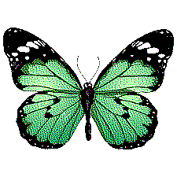
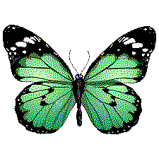

# go-haftone 

This repository contains a implemenation of [dithering](https://en.wikipedia.org/wiki/Dither) algorithm written in go. 

Dithering is the reprographic technique that use error diffusion to create the illusion of color depth in images on systems with a limited color palette  (see more [here](https://en.wikipedia.org/wiki/Dither))


### usage

Type `go run cmd/dither.go --help` to check the option supported.

```
Usage:
go run <image>
Options:
  -filters string
    	name of the filters to apply, options: 'floydSteinberg', 'burkes', 'sierra', 'sierra2', 'sierra3', 'stucki', 'atkinson' (default floydSteinberg)
  -multiplier float
    	Error multiplier (default 1.18)
  -outputdir string
			Directory name, where to save the generated images (default "output")
```


### example

The library implements the following dithering methods:  *floydSteinberg*, *burkes*, *sierra*, *sierra2*, *stucki*, *atkinson* and support monochrome and color image

| Filter|  Input  |  Output |
|:--:|:--:|:--:|
|floydSteinberg|||
|burkes|||
|sierra|||
|sierra2|||
|stucki|||
|atkinson|||


